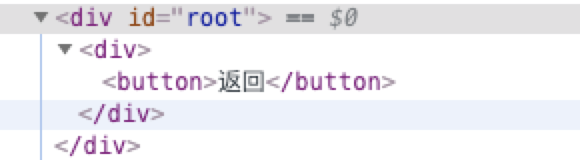
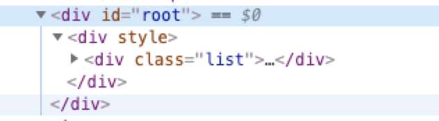
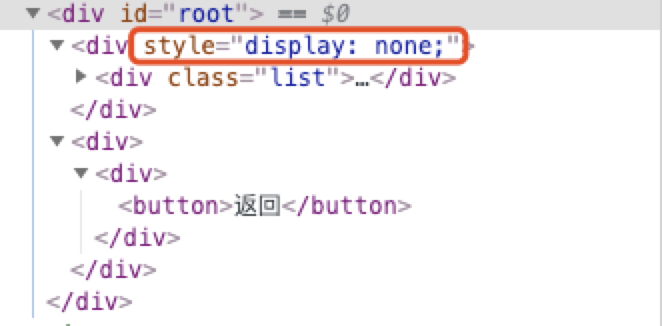

## CacheRoute 带缓存功能的路由组件

CacheRoute 是可以搭配 `react-router` 工作的、带缓存功能的路由组件，类似于 Vue 中的 `keep-alive` 功能。详细文档查看[react-router-cache-route](https://github.com/CJY0208/react-router-cache-route/blob/master/README_CN.md)

在 React-route 中如果 `Route` 中配置的组件在路径不匹配时会被卸载，对应的真实节点也会从 dom 树中删除，如下

```jsx
import { HashRouter, Link, Route, Switch } from 'react-router-dom';
function App() {
  return (
    <HashRouter>
      <Switch>
        <Route exact path='/' component={List} />
        <Route exact path='/item' component={Item} />
      </Switch>
    </HashRouter>
  );
}
```

从 `/` 跳转到 `/item` 后，dom 树节点由


变为



而 Cache route 实现缓存的办法就是让路由不匹配的组件不被卸载，通过 `display: none;` 这样的 CSS 手段（可以自定义 behavior）将真的的 DOM 节点隐藏，如下所示：

```jsx
import CacheRoute, { CacheSwitch } from 'react-router-cache-route';
function App() {
  return (
    <HashRouter>
      <CacheSwitch>
        <CacheRoute exact path='/' component={List} when='always' />
        <CacheRoute exact path='/item' component={Item} />
      </CacheSwitch>
    </HashRouter>
  );
}
```

路由变化后，节点变化可以看出只是使用 CSS 将 list 的节点隐藏




因此就能实现缓存前一个路由的滚动位置和一些数据等。当返回到前一个路由的时候，可以恢复之前的状态。

### 实现简析

查看官网文档[Route](https://reacttraining.com/react-router/web/api/Route)，知道有 4 种方法渲染匹配成功后的内容

```jsx
<Route><App /></Route>
// 推荐使用 children elements 的方法
<Route component>
// <Route path="/user/:username" component={User} />
<Route render>
// <Route path="/home" render={() => <div>Home</div>} />
<Route children> function
// <Route path="example" children={({ match }) => {/* ... */}}/>
```

将 react-route v4 版本的 [`Route.js`](https://github.com/ReactTraining/react-router/blob/v4.4.0/packages/react-router/modules/Route.js) 代码拿出来简单梳理了下：

```js
// ...
let { children, component, render } = this.props;
if (typeof children === 'function') {
  // ...
}
/* 源代码那个多层三元运算符嵌套看着真的烦，拆个 伪代码 出来便于观察 */
// PS：实际代码不是这样写的，也不能这样写，这里只是为了便于观察
const C = render ? render(props) : null;
const B = component ? React.createElement(component, props) : C;
const A = props.match ? B : null;
return (
  <RouterContext.Provider value={props}>
    {children && !isEmptyChildren(children) ? children : A}
  </RouterContext.Provider>
);
```

结合代码知道：（React route v5 版本略有不同）

- 当存在 children elements 的时候，无论路由是否匹配，其他三种方法不会生效，直接显示子元素
- 优先级：children function > `component` > `render`
- 后三种方法中，如果路由不匹配，那么都会返回 `null`，当前路由改变后，当前组件会被卸载

那么想要手动控制渲染行为，可以通过控制 children 的渲染来实现。而 Cache Route 就是**将 children 当作方法来使用，手动控制渲染的行为，用隐藏替代删除**。并且 `CacheRoute` 仅是基于 `Route` 的 `children` 属性工作的一个封装组件，不影响 `Route` 本身属性的功能。

```jsx
// CacheRoute.js
import { Route } from 'react-router-dom'
export default class CacheRoute extends Component {
  // ...
  return (
    <Route {...__restProps}>
    {props => <CacheComponent>{/**/}</CacheComponent>}
    </Route>
  );
}
```

`CacheComponent` 就是实现缓存的核心组件，如何实现可以去看源码。

另外需要使用 `CacheSwitch` 替换 `Switch`。因为在原来的 `Switch` 组件中，会遍历其子节点，传递一个 `computedMatch` 属性表示是否匹配路由，而在 `Route` 组件中，只有当 computedMatch 为真值的路由组件的内容会渲染，其他的节点都会被卸载。所以就需要对 `Switch` 做些修改，让使用缓存的路由在不匹配的时候也能通过 `Route` 的 `computedMatch` 检查。

### 示例代码实现时的一个小问题

[Demo](https://codesandbox.io/s/cache-route-example-9s67j)

- 1.7 版本以前不支持共用容器滚动造成的缓存失效

  在按照文档的 gif 实现的时候，发现触发了 cache 的生命周期，但是列表的位置却没有被缓存。经过咨询作者，给出解答：`List` 组件和 `Item` 组件可能共用了容器的滚动状态。检查代码果然是共用了 `document.body` 的滚动状态。单独给 `List` 组件设置一个容器滚动，可以实现缓存列表滚动的位置。

  ```js
  // List.js
  function List() {
    // ...
    return <div class='list'>{/**/}</div>;
  }
  ```

  ```css
  .list {
    overflow: auto;
    height: 100vh;
  }
  ```

  作者之后会在 Cache Route 中加入共用容器时的位置缓存。

- [react-router-dom v5.0+ 版本问题](https://github.com/CJY0208/react-router-cache-route/issues/45#issuecomment-534947665)
